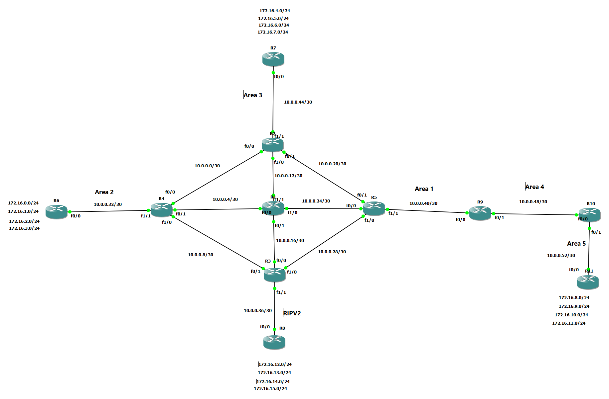

# Enterprise Multi-Area OSPF Lab

## Overview

This project demonstrates the implementation of an enterprise-scale OSPF network using GNS3.

## Technologies

- OSPF Multi-Area
- OSPF Virtual Link
- RIP v2
- Route Redistribution
- Stub Area
- Totally Stubby Area
- ABR Summarization
- ASBR Summarization

## Topology



## Features Implemented

### Multi-Area OSPF
- Backbone Area (Area 0)
- Area 1
- Area 2
- Area 3 (Totally Stub Area)
- Area 4
- Area 5

The lab demonstrates inter-area routing, route summarization, virtual links, and route redistribution between RIP v2 and OSPF.

### Advanced OSPF Features

- Virtual Link Configuration
- RIP to OSPF Redistribution
- Stub Area Configuration
- Totally Stubby Area Configuration
- ABR Route Summarization
- ASBR Route Summarization

## Verification Commands

```bash
show ip route
show ip ospf neighbor
show ip ospf database
show ip protocols
```

## Skills Demonstrated

- Enterprise Routing Design
- OSPF Troubleshooting
- Route Redistribution
- Route Summarization
- Network Optimization
## Key Achievements

- Implemented Multi-Area OSPF Design
- Configured OSPF Virtual Links
- Implemented RIP v2 to OSPF Redistribution
- Configured Totally Stub Area
- Implemented ABR Summarization
- Implemented ASBR Summarization
- Verified End-to-End Connectivity
- Performed OSPF Troubleshooting
